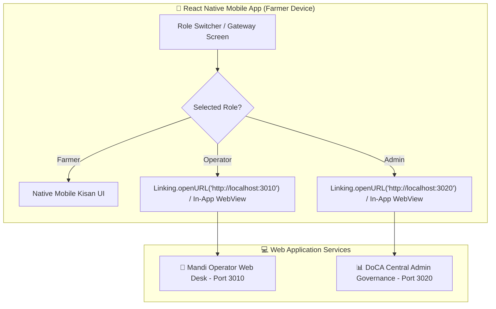

# SmartProcure — React Native Farmer Mobile App Architecture

This document details how the **SmartProcure Farmer Mobile App** (`frontend-farmer`) is structured and how it includes direct native connections to the **Operator Web Desk (`Port 3010`)** and **Central Admin Governance Portal (`Port 3020`)**.

---

## 🌐 Web Portal Integration in the React Native App

In the React Native Mobile App, farmers, operators, and administrators can navigate between native mobile views and web desk portals using **React Native Linking** (`Linking.openURL`) or an in-app **`react-native-webview`**.



---

## 📱 Web App (PWA) vs React Native Native App Comparison

| Feature | Web Prototype (`Port 3001`) | React Native App (`Android APK / iOS IPA`) |
| :--- | :--- | :--- |
| **Framework** | React 18 + Vite + TypeScript | React Native 0.74+ / Expo SDK 51 |
| **Container Elements** | `<div>`, `<section>`, `<header>` | `<View>`, `<SafeAreaView>` |
| **Typography** | `<h2>`, `<p>`, `<span>` | `<Text>` |
| **Interactions** | `<button>`, `onClick` | `<TouchableOpacity>`, `<Pressable>`, `onPress` |
| **Web Portal Links** | `window.open('http://localhost:3010')` | `Linking.openURL('http://localhost:3010')` |
| **Bottom Navigation** | CSS `.mobile-bottom-nav` | `@react-navigation/bottom-tabs` |
| **QR Code Generator** | HTML5 `<canvas>` via JavaScript | `react-native-svg` / `react-native-qrcode-svg` |
| **Voice Readout** | Web Speech Synthesis API | `expo-speech` / `react-native-tts` |

---

## 📦 React Native Component Setup (`App.native.tsx`)

Below is the complete React Native code including the native **Operator and Admin Web Portal connections**:

```tsx
import React, { useState } from 'react';
import {
  StyleSheet,
  Text,
  View,
  TouchableOpacity,
  ScrollView,
  SafeAreaView,
  StatusBar,
  Linking,
  Alert
} from 'react-native';
import QRCode from 'react-native-qrcode-svg';
import * as Speech from 'expo-speech';

export default function FarmerNativeApp() {
  const [activeTab, setActiveTab] = useState<'home' | 'book' | 'pass' | 'passbook' | 'support'>('home');
  const [lang, setLang] = useState<'te' | 'en' | 'hi'>('te');

  const activeBooking = {
    tokenId: 'PDC-774321',
    farmerName: 'Prudhvi',
    crop: 'Paddy (Grade A)',
    quantity: 45,
    stage: 'QUALITY',
    farmersAhead: 1,
    waitMinutes: 12,
    payout: 103500,
    qrPayload: JSON.stringify({ tokenId: 'PDC-774321', farmer: 'FMR-19', crop: 'Paddy Grade A' })
  };

  const openWebPortal = (url: string, portalName: string) => {
    Linking.canOpenURL(url).then((supported) => {
      if (supported) {
        Linking.openURL(url);
      } else {
        Alert.alert('Portal Connection Error', `Cannot open ${portalName} at ${url}`);
      }
    });
  };

  const handleSpeak = () => {
    const text = `నమస్కారం ${activeBooking.farmerName}. మీ టోకెన్ నంబర్ ${activeBooking.tokenId}. వేచి ఉండే సమయం ${activeBooking.waitMinutes} నిమిషాలు.`;
    Speech.speak(text, { language: 'te' });
  };

  return (
    <SafeAreaView style={styles.container}>
      <StatusBar barStyle="dark-content" backgroundColor="#ffffff" />

      {/* Top Mobile Header */}
      <View style={styles.header}>
        <View style={styles.brandRow}>
          <Text style={styles.brandIcon}>🌾</Text>
          <View>
            <Text style={styles.brandTitle}>SmartProcure</Text>
            <Text style={styles.brandSub}>Mobile Kisan App</Text>
          </View>
        </View>

        <View style={styles.headerActions}>
          <TouchableOpacity style={styles.voiceBtn} onPress={handleSpeak}>
            <Text style={styles.voiceBtnText}>🔊 వాయిస్</Text>
          </TouchableOpacity>
          <TouchableOpacity
            style={styles.langBtn}
            onPress={() => setLang(lang === 'te' ? 'en' : 'te')}
          >
            <Text style={styles.langBtnText}>{lang === 'te' ? 'తె' : 'EN'}</Text>
          </TouchableOpacity>
        </View>
      </View>

      {/* Main Scrollable Content */}
      <ScrollView style={styles.scrollBody} contentContainerStyle={styles.scrollContent}>
        {/* Active Booking Card */}
        <View style={styles.card}>
          <Text style={styles.cardHeader}>🌾 ACTIVE BOOKING TOKEN</Text>
          <Text style={styles.tokenId}>{activeBooking.tokenId}</Text>
          <Text style={styles.cropInfo}>{activeBooking.crop} • {activeBooking.quantity} Qtl</Text>

          <View style={styles.statsRow}>
            <View style={styles.statBox}>
              <Text style={styles.statLabel}>QUEUE POSITION</Text>
              <Text style={styles.statVal}>{activeBooking.farmersAhead} Ahead</Text>
            </View>
            <View style={styles.statBox}>
              <Text style={styles.statLabel}>EST. WAITING</Text>
              <Text style={styles.statVal}>~{activeBooking.waitMinutes} min</Text>
            </View>
          </View>
        </View>

        {/* QR Code Pass Container */}
        {activeTab === 'pass' && (
          <View style={styles.qrCard}>
            <Text style={styles.qrTitle}>OFFICIAL APMC GATE PASS</Text>
            <QRCode value={activeBooking.qrPayload} size={180} />
            <Text style={styles.qrSub}>Scan at Mandi Entry Gate #1</Text>
          </View>
        )}

        {/* Web Portal Connections Section */}
        <View style={styles.webConnectionsCard}>
          <Text style={styles.webTitle}>🌐 WEB PORTAL CONNECTIONS</Text>
          <Text style={styles.webSub}>Connect directly to Operator & Admin Web Portals</Text>

          <TouchableOpacity
            style={styles.operatorBtn}
            onPress={() => openWebPortal('http://localhost:3010', 'Mandi Operator Web Desk')}
          >
            <Text style={styles.operatorBtnText}>👷 Connect to Operator Web Desk (Port 3010)</Text>
          </TouchableOpacity>

          <TouchableOpacity
            style={styles.adminBtn}
            onPress={() => openWebPortal('http://localhost:3020', 'DoCA Admin Governance Portal')}
          >
            <Text style={styles.adminBtnText}>📊 Connect to Admin Portal (Port 3020)</Text>
          </TouchableOpacity>
        </View>
      </ScrollView>

      {/* Fixed Native Bottom Tab Bar */}
      <View style={styles.bottomNav}>
        <TouchableOpacity
          style={[styles.navItem, activeTab === 'home' && styles.navActive]}
          onPress={() => setActiveTab('home')}
        >
          <Text style={styles.navIcon}>🏠</Text>
          <Text style={[styles.navLabel, activeTab === 'home' && styles.navLabelActive]}>Home</Text>
        </TouchableOpacity>

        <TouchableOpacity
          style={[styles.navItem, activeTab === 'book' && styles.navActive]}
          onPress={() => setActiveTab('book')}
        >
          <Text style={styles.navIcon}>📅</Text>
          <Text style={[styles.navLabel, activeTab === 'book' && styles.navLabelActive]}>Book</Text>
        </TouchableOpacity>

        <TouchableOpacity
          style={[styles.navItem, activeTab === 'pass' && styles.navActive]}
          onPress={() => setActiveTab('pass')}
        >
          <Text style={styles.navIcon}>🎟️</Text>
          <Text style={[styles.navLabel, activeTab === 'pass' && styles.navLabelActive]}>Pass</Text>
        </TouchableOpacity>

        <TouchableOpacity
          style={[styles.navItem, activeTab === 'passbook' && styles.navActive]}
          onPress={() => setActiveTab('passbook')}
        >
          <Text style={styles.navIcon}>💳</Text>
          <Text style={[styles.navLabel, activeTab === 'passbook' && styles.navLabelActive]}>Passbook</Text>
        </TouchableOpacity>

        <TouchableOpacity
          style={[styles.navItem, activeTab === 'support' && styles.navActive]}
          onPress={() => setActiveTab('support')}
        >
          <Text style={styles.navIcon}>💬</Text>
          <Text style={[styles.navLabel, activeTab === 'support' && styles.navLabelActive]}>Support</Text>
        </TouchableOpacity>
      </View>
    </SafeAreaView>
  );
}

const styles = StyleSheet.create({
  container: { flex: 1, backgroundColor: '#f8fafc' },
  header: {
    flexDirection: 'row',
    alignItems: 'center',
    justifyContent: 'space-between',
    paddingHorizontal: 16,
    paddingVertical: 12,
    backgroundColor: '#ffffff',
    borderBottomWidth: 1,
    borderBottomColor: '#f1f5f9'
  },
  brandRow: { flexDirection: 'row', alignItems: 'center', gap: 8 },
  brandIcon: { fontSize: 24 },
  brandTitle: { fontSize: 18, fontWeight: 'bold', color: '#15803d' },
  brandSub: { fontSize: 11, color: '#64748b' },
  headerActions: { flexDirection: 'row', gap: 6 },
  voiceBtn: { backgroundColor: '#f0fdf4', paddingHorizontal: 10, paddingVertical: 6, borderRadius: 16 },
  voiceBtnText: { color: '#15803d', fontSize: 12, fontWeight: 'bold' },
  langBtn: { backgroundColor: '#f1f5f9', paddingHorizontal: 10, paddingVertical: 6, borderRadius: 16 },
  langBtnText: { color: '#0f172a', fontSize: 12, fontWeight: 'bold' },
  scrollBody: { flex: 1 },
  scrollContent: { padding: 16 },
  card: { backgroundColor: '#ffffff', borderRadius: 16, padding: 16, marginBottom: 16, borderWidth: 1, borderColor: '#e2e8f0' },
  cardHeader: { fontSize: 11, fontWeight: 'bold', color: '#64748b', marginBottom: 8 },
  tokenId: { fontSize: 24, fontWeight: 'bold', color: '#15803d' },
  cropInfo: { fontSize: 14, color: '#0f172a', marginTop: 4 },
  statsRow: { flexDirection: 'row', marginTop: 12, gap: 12 },
  statBox: { flex: 1, backgroundColor: '#f8fafc', padding: 10, borderRadius: 8 },
  statLabel: { fontSize: 10, color: '#64748b', fontWeight: 'bold' },
  statVal: { fontSize: 14, fontWeight: 'bold', color: '#0f172a', marginTop: 2 },
  qrCard: { backgroundColor: '#ffffff', borderRadius: 16, padding: 24, alignItems: 'center', marginBottom: 16, borderWidth: 1, borderColor: '#e2e8f0' },
  qrTitle: { fontSize: 14, fontWeight: 'bold', color: '#0f172a', marginBottom: 16 },
  qrSub: { fontSize: 12, color: '#64748b', marginTop: 12 },
  webConnectionsCard: { backgroundColor: '#ffffff', borderRadius: 16, padding: 16, marginBottom: 16, borderWidth: 1, borderColor: '#e2e8f0' },
  webTitle: { fontSize: 12, fontWeight: 'bold', color: '#0f172a' },
  webSub: { fontSize: 11, color: '#64748b', marginTop: 2, marginBottom: 12 },
  operatorBtn: { backgroundColor: '#15803d', padding: 12, borderRadius: 8, alignItems: 'center', marginBottom: 8 },
  operatorBtnText: { color: '#ffffff', fontWeight: 'bold', fontSize: 12 },
  adminBtn: { backgroundColor: '#273b64', padding: 12, borderRadius: 8, alignItems: 'center' },
  adminBtnText: { color: '#ffffff', fontWeight: 'bold', fontSize: 12 },
  bottomNav: {
    flexDirection: 'row',
    height: 64,
    backgroundColor: '#ffffff',
    borderTopWidth: 1,
    borderTopColor: '#e2e8f0',
    alignItems: 'center',
    justify.space-around'
  },
  navItem: { alignItems: 'center', justifyContent: 'center' },
  navActive: { opacity: 1 },
  navIcon: { fontSize: 20 },
  navLabel: { fontSize: 10, color: '#64748b', marginTop: 2 },
  navLabelActive: { color: '#15803d', fontWeight: 'bold' }
});
```
