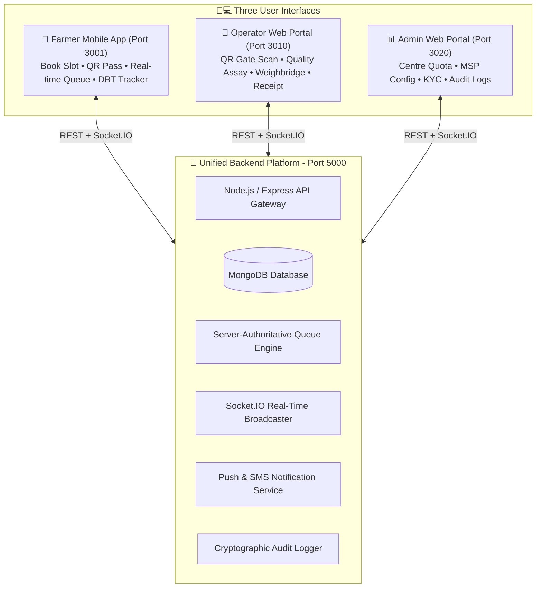

# Smart Procure — Unified Agricultural Procurement Operating System (SIH26032)

> **SIH Pitch:** *"A farmer does not merely receive a slot; they receive a predictable procurement journey—from booking and QR entry to live queue, quality, weighing, receipt, and payment tracking."*

---

## 🏛️ Executive Product Structure

**Smart Procure** is built as **one integrated procurement operating system**, powered by a single modular backend, unified database, real-time queue engine, notification service, and cryptographically auditable log.

---

## 🔄 End-to-End 13-Step User Journey

1. **Admin Governance Config**: Admin configures APMC Centre (`CTR-402`), Paddy Grade A rate (`₹2,300/Qtl`), daily quota (`1,200 Qtl`), 3 active counters, and moisture threshold ($\le 17.0\%$).
2. **Farmer OTP Registration**: Farmer enters mobile number (`+91 9125421544`), verifies 6-digit OTP (`123456`), and is assigned a unique Farmer ID: `FR-AP-2026-000124`.
3. **Smart Booking Wizard**: Farmer selects crop (*Paddy Grade A*), quantity (*45 Qtl*), centre (*Sri Lakshmi Centre #402*), date (*02 Sep 2026*), and recommended slot (*09:00 AM - 11:00 AM*).
4. **Backend Validation**: Server atomically checks slot capacity (`bookedCount < capacity`), validates crop eligibility, and reserves capacity.
5. **Token & QR Generation**: System generates Booking ID (`BK-2026-000845`), Token ID (`PDC-774321`), and Reed-Solomon ISO/IEC 18004 QR Matrix on HTML5 Canvas.
6. **Notification Delivery**: Instant Push Notification & SMS log confirmation sent to farmer.
7. **Gate Entry Verification**: Operator scans farmer's QR pass using camera or manual fallback.
8. **Arrival Status Sync**: System validates token sequence and marks farmer status as **`ARRIVED`**.
9. **Multi-Stage Queue Entry**: Farmer enters live 5-stage queue:
   $$\text{Gate Entry} \longrightarrow \text{Waiting Lounge} \longrightarrow \text{Quality Assay} \longrightarrow \text{Weighbridge} \longrightarrow \text{DBT Settlement}$$
10. **Operator Processing**:
    - **Quality Assaying**: Operator inputs moisture level ($14.2\% \le 17.0\%$) $\rightarrow$ Grade A Approved.
    - **Weighbridge**: Operator inputs Gross ($7,250\text{ kg}$) - Tare ($2,750\text{ kg}$) = Net ($45.00\text{ Qtl}$).
    - **Procurement Certificate**: System calculates payout ($45 \times ₹2,300 = ₹1,03,500$) and triggers DBT credit.
11. **Real-Time Farmer Visibility**: Farmer sees token progress (`PDC-774321`), stage changes, and ETA (`~12 mins`) update live on mobile screen via Socket.IO.
12. **Admin Monitoring**: Central Admin monitors centre congestion, queue delay metrics, MT volume, and pending DBT transfers in real time.
13. **Immutable Audit Stamping**: Audit service logs every sensitive action (*QR Scan, Quality Test, Weighbridge Weight, DBT Disbursement*) with actor ID, timestamp, and cryptographic hash.

---

## ⚡ Server-Authoritative Real-Time Queue & Smart ETA

### 1. Socket.IO Room Strategy
- `farmer:<farmerId>` — Personal notifications, payment alerts, and queue updates.
- `booking:<bookingId>` — Stage progress and QR verification status.
- `centre:<centreId>` — Mandi live queue broadcast for all waiting farmers.
- `operator:<operatorId>` — Workstation token calls.
- `admin:dashboard` — National congestion heatmap and metrics.

### 2. Smart ETA Baseline Formula
$$\text{ETA} = \left(\frac{\text{Farmers Ahead}}{\text{Active Counters}}\right) \times \text{Average Processing Time per Farmer} + \text{Current Stage Delay}$$

**Example:** $6\text{ Farmers Ahead} / 2\text{ Active Counters} \times 5\text{ mins} + 3\text{ mins Delay} = 18\text{ minutes}$.

---

## 💻 Integrated Service & Port Mapping

| Component | Target Role | Port | Technology Stack |
| :--- | :--- | :--- | :--- |
| **Unified REST & Socket API** | Core Backend | `http://localhost:5000` | Node.js, Express, Socket.IO, MongoDB |
| **Farmer Mobile App** | Farmers | `http://localhost:3001` | React 18, Phone Chassis Shell, Telugu i18n, Canvas QR |
| **Mandi Operator Desk** | Mandi Staff | `http://localhost:3010` | React 18, Desktop Workstation, QR Scanner, Quality/Weighing |
| **DoCA Central Admin Portal** | Government Admins | `http://localhost:3020` | React 18, National Governance Dashboard, Config & Audit |

---

## 🔒 Security & Database Compliance

- **Atomic Slot Reservation**: MongoDB transactions prevent double-booking on last available capacity.
- **Unique Indexes**: `farmerId`, `mobile`, `operatorId`, `centreId`, `bookingId`, `qrToken`, `procurementId`, `paymentId`, `grievanceId`.
- **Privacy & Security**: Signed opaque QR tokens; no sensitive Aadhaar or bank account numbers encoded in QR payload.
- **Audit Logs**: Cryptographic audit trails for all status changes, quality parameter overrides, weight entries, and rate updates.
