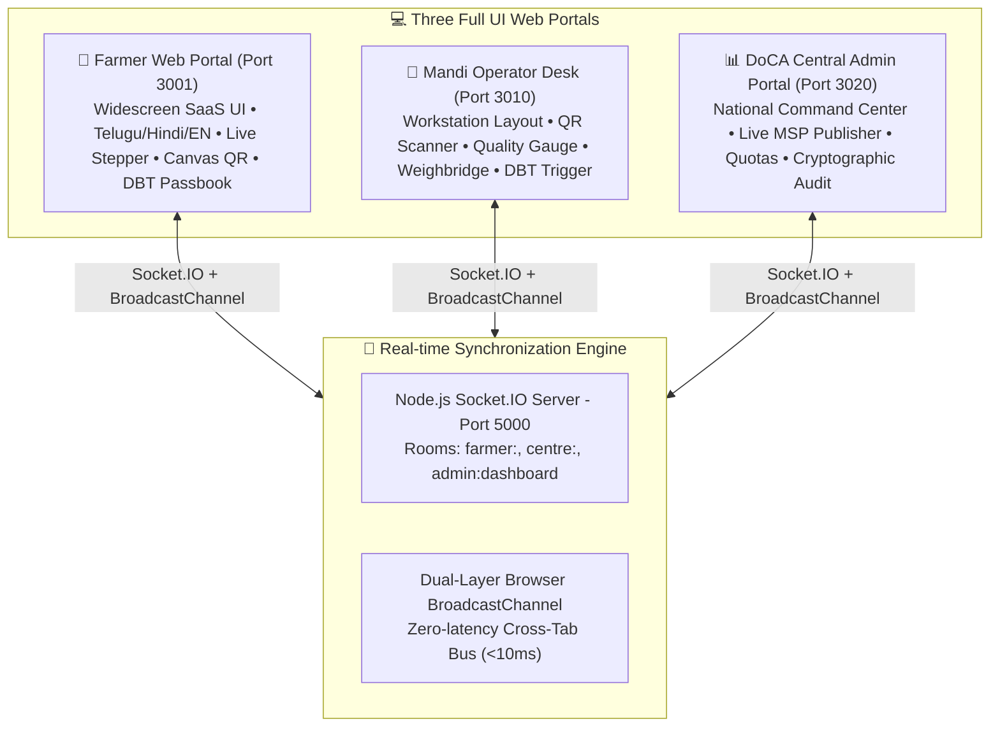

# Smart Procure — Tri-Portal Agricultural Procurement Operating System (SIH26032)

> **SIH Pitch:** *"A farmer does not merely receive a slot; they receive a predictable procurement journey—from booking and QR entry to live queue, quality, weighing, receipt, and payment tracking."*

---

## 🏛️ Tri-Portal System Architecture



| Component | Role / Target | Port | Technology Stack |
| :--- | :--- | :--- | :--- |
| **Unified REST & Socket API** | Core Backend Engine | `http://localhost:5000` | Node.js, Express, Socket.IO, MongoDB |
| **🌾 Farmer Web Portal** | Agricultural Producers | `http://localhost:3001` | React 19, Fixed Vertical Left Sidebar UI, Telugu/Hindi/EN i18n, Canvas QR, Realtime SMS |
| **👷 Mandi Operator Desk** | APMC Mandi Staff | `http://localhost:3010` | React 18, Desktop Workstation, QR Scanner, Quality/Weighing, J-Form Slip |
| **📊 DoCA Central Admin Portal** | Central Ministry Admins | `http://localhost:3020` | React 18, National Governance Dashboard, Live MSP Publisher, Audit Logs |

---

## 🚀 Unified Single Command Launch

You can now start **ALL 4 SERVICES** simultaneously with a single command from the root folder:

```bash
# Run single command to launch Backend (:5000), Farmer (:3001), Operator (:3010), and Admin (:3020)
npm run dev
```

---

## 🎨 Modern Fixed Vertical Left Sidebar & Rich Inner UI Styling

The **Farmer Web Portal (`:3001`)** now features clean sidebar typography and rich enterprise styling across all inner components:

1. **Cartoon Icon Removal**:
   - Completely removed cartoon emoji icons (`🌾`, `📅`, `🎟️`, `⏳`, `💰`, `💳`, `📍`, `📋`, `🔔`, `🚪`) from all sidebar menu buttons and the Sign Out button.
   - Built a sleek, minimal typography-driven sidebar menu with left border active pills.

2. **Rich Inner UI Component Styling**:
   - **Modern Glassmorphic KPI Cards**: Displays styled cards for Guaranteed Payouts (`₹2,87,500`), Active Gate Pass (`PDC-774321`), Live Queue Position (`1 Ahead`), and Mandi Operational Status (`AMC Guntur #402`).
   - **5-Stage Procurement Tracker**: Visual 5-step pipeline (`1. Gate Entry` ➔ `2. Waiting Lounge` ➔ `3. Quality Assaying` ➔ `4. Weighbridge Scale` ➔ `5. Direct DBT`).
   - **Procurement Day Alert Banner**: Green highlight container with slot timings (`02/09/2026 09:00 AM - 11:00 AM`) and 1-click Google Maps driving directions.
   - **AI/ML Mandi Recommendation Card**: Highlighting Salur APMC Market Yard #601 with real-time GPS distance (`6.2 km`), match score (`91% Match`), wait time, daily capacity, and live refresh actions.
   - **Forms & Cards Styling**: Added clean card wrappers (`.section-card`), rounded input fields (`.form-control-custom`), primary buttons (`.btn-primary-block`), and profile banner (`.profile-hero-banner`).


